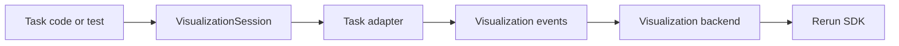

# Visualization Design

Autoware-ML now includes an isolated visualization scaffold intended for
prediction preview, calibration debugging, and dataset inspection. The initial
backend target is [Rerun](https://rerun.io/), but the task-facing API is kept
backend-neutral so future backends or offline exporters can reuse the same
task adapters.

## Design Goals

- Keep visualization out of model and transform core logic.
- Make visualization callable from tests, scripts, and future CLI commands.
- Reuse one neutral scene-event layer across calibration status, segmentation3d,
  and detection3d.
- Keep the first integration narrow: sample-at-a-time preview rather than
  framework-wide logging during training.

## Layering



### 1. Visualization Session

`autoware_ml.visualization.session.VisualizationSession` is the public entrypoint. It
owns a backend and exposes task-oriented helpers:

- `log_calibration_status(...)`
- `log_segmentation3d(...)`
- `log_segmentation3d_data(...)`
- `log_detection3d(...)`
- `log_detection3d_data(...)`

This keeps later CLI or test integration simple and avoids leaking Rerun calls
into the rest of the framework.

### 2. Task Adapters

Task adapters turn native Autoware-ML data into neutral scene events:

- `visualization/calibration_status.py`
- `visualization/segmentation3d.py`
- `visualization/detection3d.py`

These adapters understand task semantics, for example:

- calibration camera intrinsics and lidar-to-camera transforms
- segmentation point labels and confidences
- detection decoded 3D boxes and class scores

### 3. Visualization Events

The shared event layer in `visualization/events.py` defines primitives such as:

- `AnnotationContextEvent`
- `ImageEvent`
- `PointCloud3DEvent`
- `Points2DEvent`
- `Boxes3DEvent`
- `Transform3DEvent`
- `PinholeEvent`
- `ScalarEvent`
- `TextEvent`

This is the isolation boundary between task code and any concrete backend.

### 4. Backend

`visualization/rerun_backend.py` is the only place that knows the Rerun SDK.
It converts the neutral events into `rerun.Image`, `rerun.Points3D`,
`rerun.Boxes3D`, `rerun.Transform3D`, and related entities.

There is also a `NoOpVisualizationBackend` for disabled or test-only paths. The
Rerun backend is imported lazily, so the `noop` backend and the smoke tests
built on it stay usable without the Rerun SDK installed.

### Dependency compatibility

`rerun-sdk` 0.23.1 declares `numpy>=1.23`, but its generated `__array__`
implementations forward a `copy` argument that only NumPy 2.0 and later accept.
Under the pinned `numpy==1.26.4` this makes every `AnnotationContext` serialize
to an empty list, and because Rerun reports the failure as a warning rather than
an exception, class legends disappear from the viewer while the recording still
looks healthy.

`rerun_backend.py` therefore patches `rerun.datatypes.ClassId.__array__` to drop
the keyword when it is `None`, which restores NumPy 1.x support and leaves
NumPy 2.x behaviour untouched. Backend startup then logs a probe legend and
raises if it still serializes empty, so an incompatible dependency bump fails
loudly instead of quietly dropping every legend. Remove the patch once the
repository moves to NumPy 2.x or a Rerun release that fixes the conversion.

## Task Coverage

### Calibration Status

The initial calibration adapter can log:

- camera intrinsics
- lidar-to-camera extrinsics
- raw camera image
- projected lidar points overlaid on the image plane
- optional fused image preview
- optional 3D lidar points
- predicted and ground-truth calibration status
- prediction confidence and a readable status summary

This is enough to preview calibration state later from a test run or dedicated
CLI command without baking visualization into the existing preview transform.

### Segmentation 3D

The segmentation adapter can log:

- semantic class legend
- point cloud positions
- predicted semantic labels as per-point colors
- optional ground-truth labels
- sample metadata and point counts
- optional mean confidence from `pred_probs`

This matches the current segmentation prediction contract, which already
returns `pred_labels` and `pred_probs`.

Point positions are read from `points` when present, and from `coord` otherwise.
PTv3 pipelines drop raw points during grid sampling, so their samples are
matched and rendered through `coord`, with `coord[inverse]` restoring
point-level positions that align with `origin_segment` labels.

### Detection 3D

The detection adapter can log:

- semantic class legend
- optional lidar points
- decoded predicted 3D boxes
- optional ground-truth boxes
- class-colored boxes with class/score labels
- sample metadata and prediction/ground-truth counts

It normalizes both existing decoded output styles:

- `bboxes_3d` / `scores_3d` / `labels_3d`
- `bboxes` / `scores` / `labels`

## Current Integration

Visualization is now wired into a dedicated CLI preview command:

```bash
autoware-ml visualize \
    --config-name <task>/<model>/<config> \
    --checkpoint <path/to/model.ckpt> \
    --split test \
    --sample-index 0 \
    --max-samples 1
```

This path:

1. Instantiates the configured datamodule.
2. Optionally instantiates the configured model and loads a checkpoint.
3. Builds a one-sample preview dataloader for the selected split.
4. Runs the split-specific dataset transforms and collation path; when a checkpoint is provided, the model-owned preprocessing and prediction path is used.
5. Either logs transformed model inputs directly or runs `predict_step(...)` and logs predictions.
6. Emits task-specific visualization events through `VisualizationSession`.

That keeps visualization out of the Lightning evaluation loop while making the
feature immediately usable.

When no checkpoint is provided, the same command falls back to transformed-data
preview and logs the actual model inputs after the selected split pipeline,
without running prediction.

When multiple samples are previewed, the Rerun backend logs each sample on the
shared `frame` timeline, so the viewer's bottom scrubber can move between
samples directly.

## Planned Integration Points

The next integration steps are:

1. Add a narrow `--show` path for `autoware-ml test` and/or `predict`.
2. Add richer image/camera overlays for multiview detection preview.
3. Allow selected transforms or test helpers to emit visualization events
   through `VisualizationSession` instead of saving ad hoc preview files.

## Recommended Usage Pattern

The preferred future call site is:

```python
from autoware_ml.visualization.contracts import VisualizationSessionConfig
from autoware_ml.visualization.session import VisualizationSession

session = VisualizationSession.from_config(
    VisualizationSessionConfig(
        backend="rerun",
        recording_id="calibration-debug",
        web_port=9090,
        grpc_port=9876,
    )
)
session.set_step(sample_index)
session.log_calibration_status(...)
```

That keeps the dependency on Rerun confined to one backend module. Use
`rerun` for browser-based Docker workflows, and `noop` for smoke tests that
only validate the preview pipeline.
